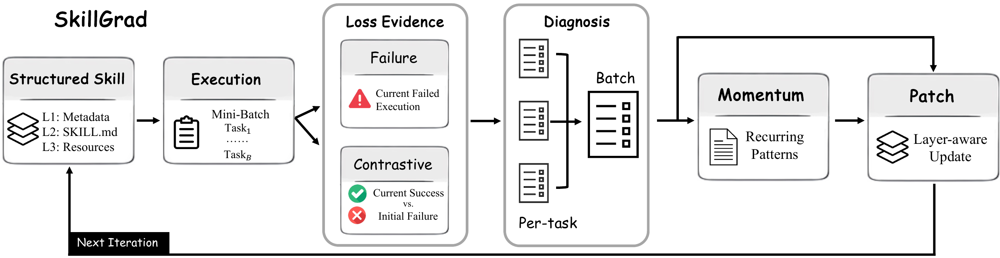

# SkillGrad

**Optimizing agent skills like gradient descent.**

SkillGrad treats an agent skill package as a structured parameter and
optimizes it through a textual analogue of gradient descent: an executor
produces trajectories, a diagnoser turns them into per-task update
signals, a momentum agent accumulates recurring patterns across
iterations, and a patcher applies a layer-aware edit to the skill.

| | |
| --- | --- |
| Paper | [arXiv:2605.27760](https://arxiv.org/abs/2605.27760) |
| Code  | <https://github.com/wwwhy725/SkillGrad> |



The optimization analogy:

| Gradient descent | SkillGrad |
| --- | --- |
| parameter θ | structured skill package `S = (H, B, Q)` |
| loss evidence | task outcomes + trajectory traces |
| per-example gradient | per-task textual diagnosis |
| momentum | persistent pattern memory + per-iteration overlay |
| parameter update | layer-aware skill patch |

## Repository layout

```
pipeline/        executor, diagnoser, momentum, patcher, training loop
prompts/         the five agent prompts
runners/         model dispatch, cost ledger, trajectory logger, …
evaluators/      xlsx grader used as the terminal loss signal
data/            dataset loader, split, layout
scripts/         base_traj.sh, train.sh, eval.sh
seeds/xlsx/      bundled initial skill (SKILL.md)
assets/          figures referenced from the README
```

## Installation

```bash
pip install -r requirements.txt

cp .env.example .env
# fill in exactly one of the two provider blocks
```

This repo includes a complete [SpreadsheetBench Verified](https://spreadsheetbench.github.io/) integration as a reference pipeline. To run it, place the dataset under `data/benchmarks/spreadsheetbench/` following the layout in `data/benchmarks/README.md`. To use SkillGrad with a new benchmark, implement the corresponding loader and grader interfaces.


## Quickstart

Three commands run an end-to-end optimization cycle from the repo root.

```bash
bash scripts/base_traj.sh   # 1. collect failure pool
bash scripts/train.sh       # 2. train SkillGrad
bash scripts/eval.sh        # 3. evaluate on held-out test split
```

Switch the backbone model via the `MODEL` environment variable:

```bash
MODEL=gpt-4.1 bash scripts/train.sh
```

The default run id is `skillgrad_<MODEL>`. Final artifacts land under
`results/runs/skillgrad_<MODEL>/`:

```
results/runs/skillgrad_gpt-5.4/
├── config.json
├── train/
│   ├── training_results.json
│   ├── iter_1/, iter_2/, …
│   └── final_skill/xlsx/
└── eval/
    ├── summary.json
    └── <task_id>/trajectory.json
```

## Initial skill

The training loop optimizes whatever initial skill you point
`--skills-dir` at. The repository ships with one bundled seed at
`seeds/xlsx/SKILL.md` and the scripts default to it. To use a different
initialization, lay it out as `<your-dir>/xlsx/SKILL.md` and pass
`SKILLS_DIR=<your-dir>` to the scripts.

## Configuration

The most common knobs are exposed as CLI flags on `pipeline/training.py`:

| Flag | Default | Purpose |
| --- | --- | --- |
| `--master-seed` | `0` | Selects the 200/200 evolution-vs-held-out split. |
| `--heldout-seed` | `42` | Splits the held-out half into validation/test. |
| `--training-seed` | `0` | Selects the 40-task training subset and batch order. |
| `--n-train` | `40` | Training set size. |
| `--batch-size` | `4` | Mini-batch size. |
| `--max-turns` | `30` | Max agent turns per executor call. |
| `--concurrency` | `4` | Parallel executions. |
| `--config-tag` | `None` | Optional suffix on the run id to avoid collisions. |

Run `python -m pipeline.training --help` for the full list.

## Citation

```bibtex
@article{wang2026skillgrad,
  title   = {{SkillGrad}: Optimizing Agent Skills Like Gradient Descent},
  author  = {Wang, Hanyu and Lan, Yifan and Cao, Bochuan and Lin, Lu and Chen, Jinghui},
  journal = {arXiv preprint arXiv:2605.27760},
  year    = {2026}
}
```
